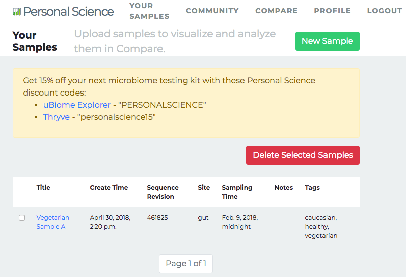
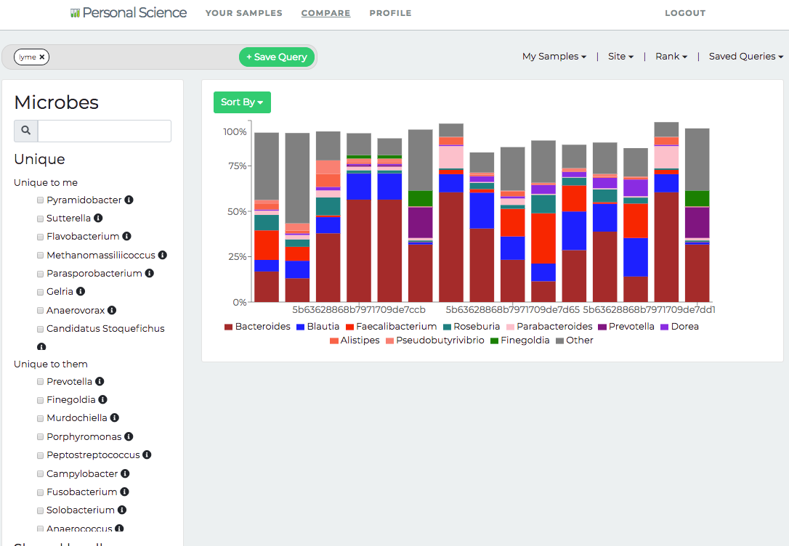
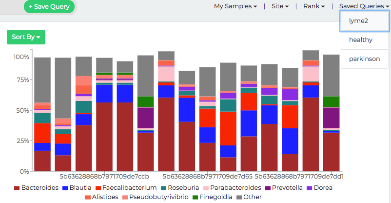
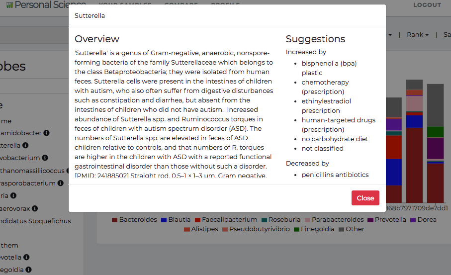

# Using Personalscience.com {#using_psicom}

The Personal Science app will let you compare your health data to other people who have agreed, like you, to share their raw data.

To get started, create your account at [https://personalscience.com](https://personalscience.com).

THIS CHAPTER IS STILL IN DRAFT
Sharing and analyzing your data is a three part process:

1. Upload your own raw data (see [our instructions](#downloaduBiome)) and tag it with descriptive attributes. (Figure \@ref(fig:usingPsicomMainScreen1))
2. Search the community for specific tags and save the results as a query
3. View and analyze your results, either by themselves or in combination with a query you created.

```{r usingPsicomMainScreen1, fig.cap = "After uploading a sample, your main screen will look something like this."}


```

## Upload your data

Press the bright green "New Sample" button to add new raw data to your account.

You should see a screen that looks like this (Figure: \@ref(fig:usingPSIcomUploadJSON)):

```{r usingPSIcomUploadJSON, fig.cap = "Copy and paste your raw uBiome JSON data here.", echo = FALSE, warning = FALSE, message = FALSE}
knitr::include_graphics("using_psicom/img/using_psicom_upload_json1.png")

```

### Title

Remember that your uploaded data is intended to be shared with every other Personal Scientist, so try to fill the "Title" field with a name that is descriptive enough for others to tell something about the sample.


### JSON

Follow the(see [our instructions](#downloaduBiome)) if you're not sure how to get the raw JSON data from uBiome.


### Tags

Similarly, in the "Tags" field, enter items that will make your data easy to be found and relevant when somebody else is searching the Community for data like theirs. Some good examples of tags:

  `healthy`, `vegetarian`, `lyme`, `keto`.

Some bad examples of tags:

`First sample`, `mine`, `after only 6.5 hrs of sleep`, `lkajdsfas`.

These tags aren't very useful because people aren't likely to search for them.


## Compare

Switch to the Compare tab for the heart of the Personal Science app. Once you've uploaded some data and created a few queries, this is where you'll spend most of your time.


Your first view shows your sample. The left panel shows which microbes are found in your sample versus other samples in the database. Click on some of the checkboxes here to see a graph of the levels of the various microbes found in the sample(s) you've uploaded.


### Create a query

Next, search through the data uploaded by others in the Personal Science community. Let's say we want to find all the other users who have tagged their data `lyme`. Type that in the search field and hit `+Save Query` and see there are a total of (in this case) 18 samples with that tag. Give this search a name so you can use it later when you compare to other users.

```{r using_psicom_community_lyme, echo = FALSE, warning = FALSE, message = FALSE}


```


To compare your sample with others, click on one of the checkboxes for the query you saved on the previous tab. For example, this is what we see when we click the `lyme2` query (Figure \@ref(fig:usingPsicomCompareLyme1)):


```{r usingPsicomCompareLyme1, fig.cap = "Select the 'lyme2' query to see how your sample(s) marked with '*' compare with others", echo = FALSE, warning = FALSE, message = FALSE}


```

Note: items marked with `*` are your samples. In this case, sample number 256 is the one that we uploaded in the first tab.

The items marked "unique" at the bottom are the microbes found exclusively in either your own sample (but not the query samples) or in the query samples but not you. This can be powerful information and should drive your next research steps. These are the essential microbes that may make a difference for whether you have the condition you are trying to study in the community samples.

### Changing your microbiome

If you click on any of the microbes listed in the "Unique to me" section, you will see a list of actions that have been documented in the scientific literature to have an effect on this microbe. Here's what you'll see if you click on the genus "Sutterella" (Figure \@ref(fig:usingPsicomCompareSutterella1)):


```{r usingPsicomCompareSutterella1, fig.cap = "Select any microbe and see a list of Take/Avoid actions that have been shown to affect the abundance", echo = FALSE, warning = FALSE, message = FALSE}


```

None of these "Take/Avoid" lists is guaranteed to affect you, but if you're looking for _something_ to consider in order to find the key to why your microbiome is different than the others in the query, this is as good a place to start as any.
